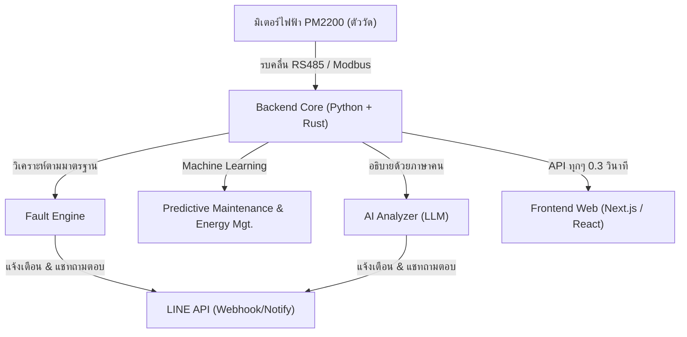

# PM2000 Presentation Report

## 1. ชื่อโครงงาน

ระบบติดตามและวิเคราะห์คุณภาพไฟฟ้าแบบอัจฉริยะด้วย PM2200 Dashboard (Smart Power Quality Monitoring & AI Diagnosis System)

---

## 2. ที่มาและความสำคัญของปัญหา

ในระบบไฟฟ้าอุตสาหกรรมหรือระบบไฟฟ้าภายในอาคารแบบเดิม การดูค่าทางไฟฟ้าจากหน้าปัดมิเตอร์อาจไม่เพียงพอ เพราะปัญหาหลายอย่างไม่ได้เกิดขึ้นตลอดเวลา แต่เกิดเป็นช่วงสั้นๆ เช่น
- แรงดันตกกระทันหัน (Voltage Sag)
- กระแสเกินหรือโหลดกระชาก (Overcurrent)
- โหลดของเฟสไม่สมดุล (Unbalance)
- ฮาร์มอนิกสูงผิดปกติที่มองด้วยตาเปล่าไม่เห็น (Harmonics)

หากให้พนักงานเดินจดมิเตอร์ตามรอบเวลา โอกาสรับรู้ปัญหาเหล่านี้ก็น้อยลงมาก ซึ่งถ้าแก้ไม่ทัน อาจทำให้มอเตอร์ไหม้ อุปกรณ์อิเล็กทรอนิกส์เสียหาย ระบบถูกตัดไฟ หรือโดนค่าปรับ Power Factor จากการไฟฟ้า

โครงงานนี้จึงถูกพัฒนาขึ้นเพื่อเป็น **"ระบบผู้ช่วยเฝ้าระวังระบบไฟฟ้าตลอด 24 ชั่วโมง"** ที่ผสานเทคโนโลยีสมัยใหม่ทั้ง AI และ IoT เข้าด้วยกัน

---

## 3. วัตถุประสงค์ของโครงงาน

1. เพื่ออ่านค่าพารามิเตอร์ทางไฟฟ้าระดับลึกจากมิเตอร์ชไนเดอร์ (Schneider PM2200) แบบอัตโนมัติความเร็วสูง
2. เพื่อแสดงผลข้อมูลผ่าน Dashboard บนเว็บไซต์แบบ Real-Time ที่ดูง่ายและใช้งานได้จากทุกที่
3. เพื่อสร้างระบบตรวจจับความผิดปกติของระบบไฟฟ้า (Fault Engine) ที่อิงตามมาตรฐานวิศวกรรม (เช่น กฟน./กฟภ./วสท./IEEE)
4. เพื่อใช้งานแบบ Proactive ด้วยการพยากรณ์ความพังของอุปกรณ์ล่วงหน้า (Predictive Maintenance)
5. เพื่อลดต้นทุนพลังงานด้วยระบบผู้ช่วยจัดการพลังงาน (Energy Management)
6. เพื่อแจ้งเตือนฉุกเฉินและสามารถโต้ตอบถาม-ตอบปัญหากับ AI ผ่าน LINE ได้ทันที

---

## 4. แผนภาพสถาปัตยกรรมรวมของระบบ (System Architecture)



---

## 5. ฟีเจอร์หลักทั้งหมด

โครงงานนี้มีฟีเจอร์เด่นถึง 9 อย่างที่ทำให้ระบบเหนือกว่า Dashboard ธรรมดาทั่วไป ดังนี้:

### 5.1 การดึงข้อมูลความเร็วสูงด้วย Rust & Bulk Read (Modbus Scanner)
มิเตอร์ไฟฟ้ารุ่นนี้สื่อสารด้วยมาตรฐานอุตสาหกรรม "Modbus" ซึ่งปกติจะดึงข้อมูลได้ช้า แต่เราปรับจูนด้วยภาษา Rust ให้กวาดข้อมูลแบบเหมาโหล (Bulk Read) รวดเดียว

**📌 ตัวอย่างโค้ดใน `pm2200_client.py`:**
```python
def read_all_parameters(self):
    # พยายามใช้แกนสมอง Rust Core คุยกับมิเตอร์ก่อน เพราะเร็วกว่าหลักเสี้ยววินาที
    if HAS_RUST_CORE:
        rust_res = pm2000_core.modbus_read_blocks(self.port, 9600, self.slave_id)
        if rust_res.get("status") == "OK":
            return rust_res # คืนค่ากลับทันที
            
    # สำรอง: หากไม่มี Rust ให้ใช้ Python ทั่วไปดึงทีละ 125 ช่องแบบเหมาบล็อค
    r1 = self.client.read_holding_registers(address=2999, count=125, slave=self.slave_id)
    scaled_value = self._decode_float32(r1.registers)
```

🗣️ **ภาษาคน:**
คล้ายๆ กับการให้เด็กไปจดมิเตอร์รอบโรงงาน ถ้าจดทีละตัวแล้วกลับมาบอก ระบบเว็บเราจะอืดมาก โค้ดนี้สอนให้มัน "ถ่ายรูปหน้าปัดรวดเดียวผ่านภาษา Rust ที่ทำงานเร็วที่สุด" แกะตัวเลขทั้งหมดเสร็จในเสี้ยววินาที ทำให้ได้ข้อมูลแม่นยำและเว็บไม่หน่วง

---

### 5.2 การอัปเดตหน้าจอแบบขยับตลอดเวลา (Real-Time Polling ด้วย SWR)
เราใช้เทคโนโลยีของ React เพื่อให้ตู้ควบคุมแสดงกราฟขยับแบบสดๆ โดยไม่ต้องกด F5

**📌 ตัวอย่างโค้ดใน `frontend/app/page.tsx`:**
```typescript
// สั่งให้ React ดึงข้อมูลจาก API เรื่อยๆ อัตโนมัติ (Polling)
const { data, error, mutate } = useSWR(
  isPolling ? `${API_BASE_URL}/snapshot` : null, 
  fetcher, 
  { 
    refreshInterval: 300,    // ยิงไปขอข้อมูลใหม่ทุกๆ 300 มิลลิวินาที 
    revalidateOnFocus: false // ไม่ให้กระตุกเวลาสลับจอ
  }
);
```

🗣️ **ภาษาคน:**
หุ่นยนต์ฝั่งหน้าเว็บ (SWR) จะโทรไปถามหลังบ้านทุกชั่วพริบตา (0.3 วินาที) ว่า "ตัวเลขเปลี่ยนหรือยัง?" หากเปลี่ยน กราฟและเข็มทิศบนหน้าจอจะขยับตามทันทีให้อารมณ์เหมือนยืนจ้องหน้าปัดจริง

---

### 5.3 ระบบตรวจจับความผิดปกติ (Fault Engine ตามมาตรฐานการไฟฟ้า)
วิเคราะห์ค่าตามจริงโดอยอ้างอิง **มาตรฐานจริงของ วสท. / กฟภ. / กฟน.** 

**📌 ตัวอย่างโค้ดใน `fault_engine.py`:**
```python
def diagnose_faults(data):
    v_avg = data.get("V_LN_avg", 0) # ดึงค่าแรงดันเฉลี่ย
    
    # ห้ามไฟตกต่ำกว่าเกณฑ์ กฟภ. (เช่น ต่ำกว่า 200V)
    if v_avg < T["v_sag_critical"]: 
        alerts.append({
            "category": "voltage_sag",
            "severity": "critical",
            "message": f"ไฟตกรุนแรง {v_avg:.1f}V (ต่ำกว่าเกณฑ์ต่ำสุด กฟภ.)",
            "detail": "อันตรายมอเตอร์เสี่ยงไหม้ ควรสับคัตเอาต์หรือเช็คสายส่งด่วน!"
        })
```

🗣️ **ภาษาคน:**
ระบบกางคู่มือวิศวกรรมรอไว้เลย พอมิเตอร์ส่งเลข 205V มา มันเทียบทันที "อุ้ย! ต่ำกว่าเกณฑ์มาตรฐาน" มันจะชูไฟแดงขึ้นหน้าจอพร้อมบอกด้วยว่าอาการนี้ทำมอเตอร์พังได้ ให้รีบแก้ตรงไหนบ้าง

---

### 5.4 วิศวกร AI ประจำเว็บ (AI Analyzer Dashboard)
ค่าตัวเลขยากๆ เช่น Harmonic 8% มันร้ายแรงแค่ไหน เราบังคับให้ AI สวมบทบาทเป็น "วิศวกรไฟฟ้าอาวุโส" เพื่อมาอธิบายให้ผู้ใช้ทั่วไปอ่าน

**📌 ตัวอย่างโค้ดใน `ai_analyzer.py`:**
```python
def generate_power_summary(data):
    prompt = f"""
    คุณคือผู้เชี่ยวชาญด้าน Power Quality ที่วิเคราะห์ข้อมูลจาก PM2200
    วิเคราะห์ข้อมูลนี้ให้ช่างเทคนิคเข้าใจง่าย:
    แรงดันปัจจุบัน: {data.get('V_LN_avg')} V
    Power Factor: {data.get('PF_Total')}
    
    ชี้ให้เห็นชัดเจนหาก PF ต่ำกว่า 0.85 เสี่ยงโดนค่าปรับจากการไฟฟ้า และแนะนำวิธีแก้ 
    """
    response = call_dashscope_api([{"role": "user", "content": prompt}])
    return response.content
```

🗣️ **ภาษาคน:**
เมื่อค่ามันดูยาก ระบบจะแคปตัวเลขสั้นๆ ส่งข้ามอินเตอร์เน็ตไปหา ChatGPT/Qwen ทันที แล้วบอกว่า "นายช่วยอธิบายหน่อยว่าโรงงานวันนี้จ่ายไฟดีมั้ย" ระบบก็จะพ่นภาษาไทยที่อ่านง่าย สรุปเป็นข้อๆ ลอยขึ้นมาบทหน้าเว็บได้ทันที

---

### 5.5 ระบบทำนายอายุการใช้งาน (Predictive Maintenance Machine Learning)
เราฝังโมเดลคณิตศาสตร์ (Isolation Forest) เพื่อจับผิดสัญญาณก่อนเครื่องจักรจะเสีย 

**📌 ตัวอย่างโค้ดใน `predictive_maintenance.py`:**
```python
def predict_maintenance(self, data: Dict):
    # สร้างแพตเทิร์นกระแสไฟ และ ฮาร์มอนิก 
    features = [ data.get("V_LN_avg"), data.get("I_avg"), data.get("THDv_avg") ]
    
    # โยนเข้าตรวจใน AI Model 
    prediction = self.model.predict([features])
    maintenance_needed = prediction[0] == -1  # อัลกอริทึมชี้ว่าแปลกประหลาด (-1)
    
    return {
        "maintenance_needed": maintenance_needed,
        "message": "เริ่มพบความเสื่อมของระบบสายไฟ เตรียมบำรุงรักษา"
    }
```

🗣️ **ภาษาคน:**
สมมุติว่าทุกวันเครื่องจักรเรากินไฟรูปแบบหนึ่ง แต่วันนี้คลื่นไฟมันแกว่งนิดๆ มนุษย์มองไม่เห็น แต่ AI Model จับได้ว่า "คลื่นนี้เคสเก่ามันคือลางสังหรณ์มอเตอร์กำลังจะไหม้" มันจะแจ้งเตือนเราล่วงหน้าให้เรียกช่างมาตรวจก่อนที่ไฟจะดับทั้งโรงงาน
--

### 5.7 ระบบแจ้งเตือนและแชทกับ AI ผ่าน LINE (LINE Notify & Webhook)
ระบบเชื่อมผ่าน LINE สามารถแจ้งเตือน หรือเราสามารถ "แชทถาม" AI ในไลน์ได้เลย

**📌 ตัวอย่างโค้ดใน `routes/line_webhook.py`:**
```python
@router.post("/webhook")
async def line_webhook(request: Request):
    # เมื่อมีคนพิมพ์ถามในไลน์ เช่น "ตอนนี้ไฟปกติดีไหม?"
    user_msg = event["message"]["text"]
    
    # เรียกให้ AI ดึงฐานข้อมูลล่าสุดมาตอบแชท
    ai_response = await generate_line_chat_response(user_msg, current_data)
    
    # พิมพ์ข้อความภาษาคนกลับเข้าไปในแวดวงแชทไลน์
    await _line_reply(reply_token, ai_response)
```

🗣️ **ภาษาคน:**
เหมือนมีเลขาเฝ้าโรงงานประจำอยู่ใน LINE หากคุณทักไลน์บอทไปว่า "ไฟเฟส 3 ปกติดีปะ" ระบบหลังบ้านจะวิ่งหยิบตัวเลขปัจจุบัน โยนให้ AI สรุป และตอบแชทกลับหานายจ้างว่า "แรงดัน 220V ปกติดีครับนาย ไม่มีปัญหาอะไร"

---

### 5.8 เครื่องจำลองสถานการณ์และทดสอบ (Simulator Mode)
ระบบมีปุ่มคลิกเดียวเพื่อจำลองสถานการณ์ไฟตก หรือ จำลองตัวเลขสุ่มๆ ได้

**📌 ตัวอย่างอินเตอร์เฟสใน `page.tsx`:**
```typescript
<button onClick={handleToggleSimulateMode}>
    {isSimulateMode ? '🧪 SIMULATOR' : '🔌 REAL DEVICE'}
</button>
```

🗣️ **ภาษาคน:**
สำหรับนักศึกษาทำโปรเจคหรือช่างที่อยากลองระบบก่อนติดตั้งจริง สามารถกดสลับเป็น "เครื่องปั่นเลขปลอม" เพื่อทดสอบปุ่มแจ้งเตือน และกราฟหน้าจอได้ด้วยตัวเอง

---

### 5.9 ระบบบันทึกข้อมูลและออกรายงานคลิกเดียว (Data Logging & PDF Report)
รวบรวมข้อมูลทุกเสี้ยววินาทีเพื่อดาวน์โหลดเป็น Excel ย้อนหลัง หรือแคปหน้าจอทำรายงานส่งผู้บริหารใน 1 หน้ากระดาษA4

**📌 การทำงานของระบบ One-Page Report:**
ปุ่มอัจฉริยะที่จะรวบรวมกราฟทั้งหมด ซ่อนแถบเมนูที่ไม่จำเป็น ขยายจอให้เต็ม A4 และเซพออกมาเป็นไฟล์ PDF ได้ทันที ไม่ต้องมานั่งตัดต่อตารางเอง

---

## 6. ประโยชน์ที่ได้รับจากโครงงาน

1. **ลดพึ่งพากำลังคน (Manpower):** ไม่ต้องจ้างคนให้เดินไปจดมิเตอร์หรือคอยเฝ้าตู้คอนโทรล 24 ชม.
2. **แก้ปัญหาแบบรู้อนาคต (Proactive):** ด้วยการทำนายผลล่วงหน้า ช่วยลดความเสียหายรุนแรงระดับเครื่องจักรไหม้
3. **ลดค่าไฟและค่าปรับ (Cost Savings):** การไฟฟ้ามีค่าปรับ Power Factor ก้อนใหญ่ถ้าระบบผลิตไฟแย่ ระบบเตือนเราได้ก่อนบิลมาเก็บ
4. **ความแม่นยำทางวิศวกรรม และลดกำแพงภาษา:** ด้วยระบบ AI ที่สร้างขึ้น ปัญหาซ่อนเร้นอย่าง ฮาร์มอนิก (ความเพี้ยนของคลื่นไฟ) ช่างที่ไม่เชี่ยวชาญก็สามารถอ่านรายงานภาษาไทยแล้วแก้ไขตามคำแนะนำได้ถูกจุด 

---

## 7. ผลการทดสอบและสถานะระบบ (Testing Results)

- ✅ **ผ่านการวิ่งทดสอบโค้ด (Unit Tests):** รันผ่านทั้ง 75 กรณีสำหรับตรรกะระบบ
- ✅ **ต่อมิเตอร์จริงผ่าน USB-RS485 วิ่งเรียบ:** ดึงข้อมูลได้จริงความเร็วสูงผ่าน Rust ไม่มีสะดุด
- ✅ **แจ้งเตือนผ่าน LINE ออฟฟิเชียลทำงานจริง:** หากไฟกระตุก ระบบไลน์จะผลักป้ายรายงานพร้อมคำแนะนำของ AI มารันบนมือถือเสมอ
- ⚠️ **ข้อจำกัดเล็กน้อย:** การแชทตอบโต้กับ AI ใน LINE ขึ้นอยู่กับสัญญาณอินเทอร์เน็ตในการโยนข้อมูลหาเซิฟเวอร์ภายนอก หากออฟไลน์ไป ระบบพื้นฐานเตือนสั้นๆ ยังทำงานได้ปกติ แต่คำแนะนำยาวๆ อาจสูญเสียไป 

---

## 8. โครงสร้างสไลด์ที่แนะนำสำหรับการพรีเซ็นต์งาน (10-12 สไลด์)

*หน้า 1:* ชื่อโครงงาน และ ภาพหน้าเว็บ Dashboard รวมๆ 
*หน้า 2:* ปัญหาที่เจอ (Pain point: เดินจดเหนื่อย, เครื่องพังไม่รู้ตัว, ไฟตกลูกน้องไม่บอก)
*หน้า 3:* วัตถุประสงค์
*หน้า 4:* สถาปัตยกรรม (Architecture) แผนภาพโครงสร้างดูน่าเชื่อถือ
*หน้า 5:* โชว์ฟีเจอร์เด่นเบอร์ 1-3 (Dashboard + Fault Engine มารฐานการไฟฟ้า)
*หน้า 6:* โชว์ฟีเจอร์เด่นเบอร์ 4-6 (Predictive Maintenance & Energy)
*หน้า 7:* โชว์แจ้งเตือนผ่าน LINE และถามตอบผ่านระบบ Webhook
*หน้า 8:* เจาะลึกความท้าทายโค้ด Modbus + Rust ที่ทำให้ดึงข้อมูลเสี้ยววินาที (ยกตัวอย่างภาษาคน)
*หน้า 9:* เจาะลึกเรื่อง AI Analyzer ที่คอยเขียนรายงานสรุปให้สดๆ 
*หน้า 10:* โชว์ทดสอบสด (Live Demo หรือ วิดีโอสั้น)
*หน้า 11:* สรุปผลลัพธ์ ประโยชน์ และ ทิศทางต่อยอด 
*หน้า 12:* ถาม-ตอบ (Q&A)

---

## 9. บทสรุปพูดปิดจบงานอย่างเฉียบคม (Pitch / Takeaway)

"โครงงาน PM2000 Dashboard สรุปสั้นๆ ว่า ไม่ใช่แค่การเอาหน้าปัดแผงไฟไปเปิดเป็นเว็บไซต์ แต่เราสร้าง **'ผู้พิทักษ์โรงงานดิจิทัลที่มีสมอง'** 

หลังบ้านเรามีโค้ดสุดล้ำที่กวาดข้อมูลเสี้ยววินาที มีตรรกะที่คอยจับผิดไฟตกร่วมกับมาตรฐานการไฟฟ้านครหลวง และที่เด่นที่สุดคือเราจับ AI มาสวมบท 'หัวหน้าวิศวกรไฟฟ้า' เพื่อสรุปปัญหายากๆ ให้กลายเป็นคำเตือนบนมือถือช่างที่ดูง่ายที่สุด ระบบนี้จะช่วยลดค่าปรับ ลดเวลาเครื่องจักรหยุดทำงาน และยกระดับการมอนิเตอร์ไฟระดับอุตสาหกรรมได้อย่างเป็นรูปธรรมและต้นทุนต่ำครับ ขอบคุณครับ"
